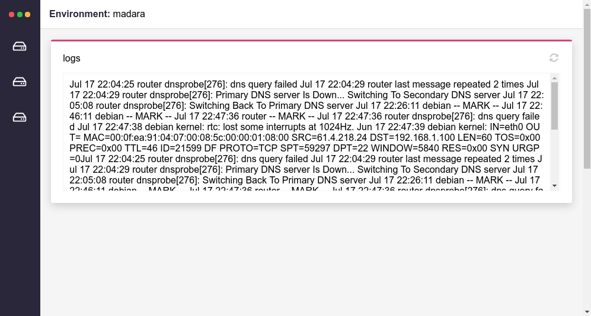

<h1 align="center">environment</h1>

<p align="center">
  
</p>

<p align="center">
  <a href="https://travis-ci.org/jeffersondanielss/environment"> </a><a href="https://github.com/sindresorhus/xo"> </a><a href="https://github.com/prettier/prettier">  </a>
</p>

<p align="center">
  
</p>

## Summary

1. [Introduction](#introduction)
1. [Development](#development)
1. [Commands](#commands)
1. [Contributing](/CONTRIBUTING.md)
1. [Lisence](/LICENSE)


## Introduction
Proof of concept from a visual way of consuming logs, managing services, and executing bash scripts on remote servers.

## Development
To install dependencies and start project

```bash
npm init
``` 

## Commands

command | description
------ | ---- 
yarn start | initialize electron app
yarn pack | build linux app
yarn linter | run xo linter